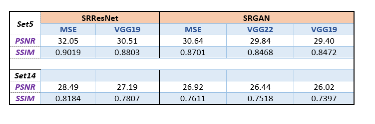
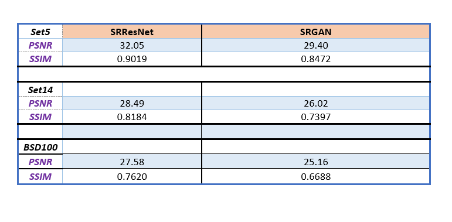

<p  align="center">

</p>

<h1>Introduction</h1>
<p>
 The computational enhancement of image resolution, is known as super-resolution. Generative Adversarial Networks (GANs) are one of newer methods that have been applied to super resolution and in this notebook we use a Super-Resolution GAN (SRGAN) to enhance subsampled OCT scans.

The SRGAN, introduced in 2016, addressed the issue of reconstructing high resolution (HR) images from low resolution (LR) images such that fine texture detail in the reconstructed super resolution (SR) images was not lost. Here the authors used a perceptual loss instead of a pixel-wise Mean Squared Error (MSE) loss. MSE loss approaches give a high Peak Signal-to-Noise (PSNR) value, but they also tend to produce overly-smooth images with insufficient high-frequency details. The perceptual loss by contrast has a content loss component that computes pixel-wise differences in feature space (not pixel space) and this results in an SR image that is closer to the subjective evaluation of human observers.

The SRGAN model uses a deep neural network (built with residual blocks) and optimized using perceptual loss in a GAN framework.
A VGG-19 network is used for feature extraction; this allows us to compute the feature distance between the original and generated images sent through the feature extractor.

This architecture used a pre-trained VGG-19 feature extractor and gave photorealistic results on large (4x) upsampled low resolution images. It has been applied to the DIV2K, CelebA and other natural image datasets and here we want to see how it performs on OCT data. This network will serve as a baseline for further experiments with upscaling, choice of feature extractor etcetera.

The SRGAN is implemented as follows:

Training

We downsample HR OCT images by 4x to synthetically create LR training data. This gives us pairs of HR and LR images for the training data set.
The Generator upsamples LR images by 4x and will be trained to generate SR images.
The discriminator will be trained to distinguish between HR/SR images; the GAN loss is backpropagated to the discriminator and the generator.
Evaluation
The visual quality of generated images will be observed. In addition standard quantitative metrics, Peak Signal-to-Noise Ratio and Structural Similarity Index (PSNR, SSIM), will be used to assess the results.
</p>
<h1>SRGAN</h1>
<p> was proposed by researchers at Twitter. The motive of this architecture is to recover finer textures from the image when we upscale it so that it’s quality cannot be compromised. There are other methods such as Bilinear Interpolation that can be used to perform this task but they suffer from image information loss and smoothing. In this paper, the authors proposed two architectures the one without GAN (SRResNet) and one with GAN (SRGAN). It is concluded that SRGAN has better accuracy and generate image more pleasing to eyes as compared to SRGAN.</p>
 
<h1>Architecture</h1>
<p>: Similar to GAN architectures, the Super Resolution GAN also contains two parts Generator and Discriminator where generator produces some data based on the probability distribution and discriminator tries to guess weather data coming from input dataset or generator.  Generator than tries to optimize the generated data so that it can fool the discriminator. Below are the generator and discriminator architectural details:</p>
 <p align="center"></p>
 
 
 <h1>Generator Architecture:</h1>

<p>The generator architecture contains residual network instead of deep convolution networks because residual networks are easy to train and allows them to be substantially deeper in order to generate better results. This is because the residual network used a type of connections called skip connections.</p>
<p align="center">
</p>

<p>There are B residual blocks (16), originated by ResNet. Within the residual block, two convolutional layers are used, with small 3×3 kernels and 64 feature maps followed by batch-normalization layers and ParametricReLU as the activation function.

The resolution of the input image is increased with two trained sub-pixel convolution layers.

This generator architecture also uses parametric ReLU as an activation function which instead of using a fixed value for a parameter of the rectifier (alpha) like LeakyReLU. It adaptively learns the parameters of rectifier and   improves the accuracy at negligible extra computational cost

  During the training, A high-resolution image (HR) is downsampled to a low-resolution image (LR). The generator architecture than tries to upsample the image from low resolution to super-resolution. After then the image is passed into the discriminator, the discriminator and tries to distinguish between a super-resolution and High-Resolution image and generate the adversarial loss which then backpropagated into the generator architecture.</p>
 
 
 
 <h1>Discriminator Architecture: </h1>

<p>The task of the discriminator is to discriminate between real HR images and generated SR images.   The discriminator architecture used in this paper is similar to DC- GAN architecture with LeakyReLU as activation. The network contains eight convolutional layers with of 3×3 filter kernels, increasing by a factor of 2 from 64 to 512 kernels. Strided convolutions are used to reduce the image resolution each time the number of features is doubled. The resulting 512 feature maps are followed by two dense layers and a leakyReLU applied between and a final sigmoid activation function to obtain a probability for sample classification.</p> 
 <p align="center">
 </p>
          
    
          
          
          
 <h1>Loss Function:</h1>

<p>The SRGAN uses perpectual loss function (LSR)  which is the weighted sum of two loss components : content loss and adversarial loss. This loss is very important for the performance of the generator architecture:</p>

<ul><li><b>Content Loss:</b> We use two types of content loss in this paper : pixelwise MSE loss for the SRResnet architecture, which is most common MSE loss for image Super Resolution. However MSE loss does not able to deal with high frequency content in the image that resulted in producing overly smooth images. Therefore the authors of the paper decided to  use loss of different VGG layers. This VGG loss is based on the ReLU activation layers of the pre-trained 19 layer VGG network. This loss is defined as follows:</li></ul> 
 <p align="center">
 </p>

 <ul><li><b>Adversarial Loss:</b> The Adversarial loss is the loss function that forces the generator to image more similar to high resolution image by using a discriminator that is trained to differentiate between high resolution and super resolution images.</li></ul>

<p align="center">


<ul><li>Therefore total content loss of this architecture will be :</li></ul>

 <p align="center">

</p>
 


 
 
 


<h1 color="green"><b>Results</b></h1>

<p align="center">
 </p>
 <p>In the above layer MSE means we take simple  mean squared pixelwise error as content loss, VGG22 indicate the feature map obtained by the 2nd convolution (after activation) before the 2nd maxpooling layer within the VGG19 network and wwe calculate the VGG loss using formula described above. This loss is  thus loss on the low-level features. Similarly VGG 54 uses loss calculated on the the feature map obtained by the 4th convolution (after activation) before the 5th maxpooling layer within the VGG19 network. This represents loss on  higher level features from deeper network layers with more potential to focus on the content of the images</p>
 <p align="center">
 </p>
  
  
  <h3>The main contributions of this paper is:</h3>

<ul><li>This paper generates state-of-the-art results on upsampling (4x) as measured by PNSR (Peak Signal-to-Noise Ratio) and SSIM(Structural Similarity) with 16 block deep SRResNet network optimize for MSE.</ul></li>
<ul><li>The authors propose a new  Super Resolution GAN in which the authors replace the MSE based content loss with the  loss calculated on VGG layer</ul></li>
<ul><li>SRGAN was able to generate state-of-the-art results which the author validated with extensive Mean Opinion Score (MOS) test on three public benchmark datasets.</ul></li>
  
 <h1>References:</h1> 
  <ul><li><a href="https://drive.google.com/file/d/1UBXO2l-sAA48Aeqb2jAjLcCxArwEW98t/view?usp=sharing" target="_blank">SRGAN PAPER</a></ul></li>

<h1 color="green"><b>Inference</b></h1>
<p>Run the infer.py script and pass the required arguments (modelPath, inputPath, outputPath) <br>

python -m infer \ <br>
--modelPath="model.h5" \ <br>
--inputPath="lr_image_path" `Or Image Url ` \ <br>
--outputPath="sr_image_path" \ <br>


<h1 color="green"><b>Instructions to Install our SRGAN Package</b></h1>
<p>Our Package can be found in this link.
 <a href="https://pypi.org/project/SuperResolution-GANs/0.0.3/">https://pypi.org/project/SuperResolution-GANs/0.0.3/</a></p>

1. Install:

```python
pip install SuperResolution-GANs==0.0.3
```
2. Download Our Model:

```python
import gdown
url = 'https://drive.google.com/uc?id=1MWDeLnpEaZDrKK-OjmzvYLxfjwp-GDcp'
output = 'model.h5'
gdown.download(url, output, quiet=False)

```

3. Generate Super Resolution Image:

```python
from super_resolution_gans import srgan_utils
LR_img,SR_img = srgan_utils.SRGAN_predict(lr_image_path"image.jpg", model_path="model.h5")
```
4. show Super Resolution image:

```python
show_image(SR_img)
```


